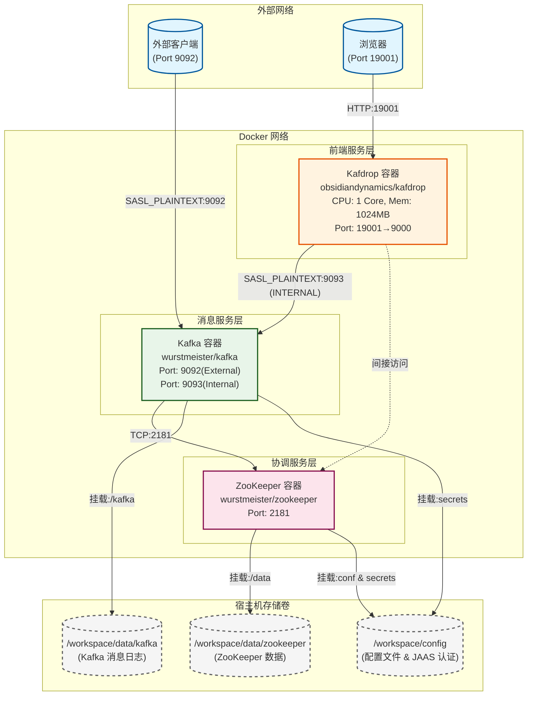

# Kafka Docker 部署架构文档

## 1. 项目概述

本项目是基于 Docker Compose 实现的 Kafka 单节点部署方案，采用 SASL_PLAINTEXT 安全认证机制。整个部署架构包含三个核心容器服务：ZooKeeper、Kafka 和 Kafdrop 监控工具。

## 2. 容器组件职责

| 容器名称 | 镜像 | 职责 | 端口映射 |
|---------|------|------|---------|
| zookeeper | wurstmeister/zookeeper | Kafka 集群协调服务，管理元数据和消费者偏移量 | 2181:2181 |
| kafka | wurstmeister/kafka | 分布式消息队列核心服务，负责消息的存储和传输 | 9092:9092 (External), 9093 (Internal) |
| kafdrop | obsidiandynamics/kafdrop | Kafka Web UI 监控工具，提供可视化管理界面 | 19001:9000 |

## 3. 容器依赖关系

```
zookeeper (基础服务)
    └── kafka (依赖 zookeeper)
            └── kafdrop (依赖 kafka 和 zookeeper)
```

## 4. 网络通信链路

### 4.1 监听器配置

Kafka 配置了双监听器模式：

- **INTERNAL 监听器**: `kafka:9093`
  - 协议：SASL_PLAINTEXT
  - 用途：容器间内部通信（kafdrop → kafka）
  
- **EXTERNAL 监听器**: `172.18.0.155:9092`
  - 协议：SASL_PLAINTEXT
  - 用途：外部客户端访问

### 4.2 通信流程

```
外部客户端 → [9092] → Kafka (EXTERNAL)
Kafdrop → [9093] → Kafka (INTERNAL)
Kafka → [2181] → ZooKeeper
Kafdrop -.->|间接访问| ZooKeeper
```

## 5. 数据持久化方案

| 容器 | 宿主机路径 | 容器内路径 | 用途 |
|-----|-----------|-----------|------|
| zookeeper | ./data/zookeeper | /data | ZooKeeper 数据快照和事务日志 |
| zookeeper | ./config | /opt/zookeeper-3.4.13/conf | ZooKeeper 配置文件 |
| zookeeper | ./config | /opt/zookeeper-3.4.13/secrets | JAAS 安全认证配置 |
| kafka | ./data/kafka | /kafka | Kafka 消息日志数据 |
| kafka | ./config | /opt/kafka/secrets | Kafka JAAS 安全认证配置 |

## 6. 资源配置策略

### Kafdrop 资源限制
- CPU: 1 核心 (`cpus: '1'`)
- 内存：1024MB (`mem_limit: 1024m`)

### ZooKeeper & Kafka
- 使用默认资源配置
- 可通过环境变量调整 JVM 参数

## 7. 安全认证配置

### 7.1 认证机制
- **协议**: SASL_PLAINTEXT
- **用户名**: admin
- **密码**: RvB9SuYrJMPR

### 7.2 关键配置文件

**server_jaas.conf** - JAAS 登录模块配置：
- Client: ZooKeeper 客户端认证
- Server: ZooKeeper 服务端认证
- KafkaServer: Kafka broker 认证
- KafkaClient: Kafka 客户端认证

**zoo.cfg** - ZooKeeper 核心配置：
- tickTime: 2000ms
- clientPort: 2181
- SASL 认证启用配置

## 8. Mermaid 部署架构图



## 9. 网络分区说明

虽然当前配置未显式定义多个 Docker 网络，但逻辑上可分为以下网络分区：

| 网络分区 | 包含容器 | 访问方式 |
|---------|---------|---------|
| 前端访问网络 | Kafdrop | 外部浏览器访问 (19001) |
| 后端服务网络 | Kafka (INTERNAL) | 容器间通信 (9093) |
| 外部接入网络 | Kafka (EXTERNAL) | 外部客户端访问 (9092) |
| 协调服务网络 | ZooKeeper | 内部服务发现 (2181) |

## 10. 负载均衡与反向代理

当前单节点部署方案中：
- **负载均衡**: 未配置（单 Broker 架构）
- **反向代理**: 未配置（直接端口映射）

### 扩展建议（生产环境）
如需扩展为生产级部署，建议添加：
- Nginx/HAProxy 作为反向代理
- 多 Kafka Broker 实现负载均衡
- Docker Swarm/Kubernetes 进行容器编排

## 11. 环境变量配置汇总

### ZooKeeper 环境变量
| 变量名 | 值 | 说明 |
|-------|-----|------|
| ZOOKEEPER_CLIENT_PORT | 2181 | 客户端连接端口 |
| ZOOKEEPER_TICK_TIME | 2000 | 心跳间隔 (ms) |
| SERVER_JVMFLAGS | -Djava.security.auth.login.config=/opt/zookeeper-3.4.13/secrets/server_jaas.conf | JAAS 配置路径 |

### Kafka 环境变量
| 变量名 | 值 | 说明 |
|-------|-----|------|
| KAFKA_BROKER_ID | 0 | Broker ID |
| KAFKA_ZOOKEEPER_CONNECT | zookeeper:2181 | ZooKeeper 连接地址 |
| KAFKA_LISTENERS | INTERNAL://:9093,EXTERNAL://:9092 | 监听器配置 |
| KAFKA_ADVERTISED_LISTENERS | INTERNAL://kafka:9093,EXTERNAL://172.18.0.155:9092 | 广播地址 |
| KAFKA_LISTENER_SECURITY_PROTOCOL_MAP | INTERNAL:SASL_PLAINTEXT,EXTERNAL:SASL_PLAINTEXT | 安全协议映射 |
| KAFKA_INTER_BROKER_LISTENER_NAME | INTERNAL | 内部通信监听器 |
| KAFKA_SASL_ENABLED_MECHANISMS | PLAIN | SASL 机制 |
| KAFKA_OPTS | -Djava.security.auth.login.config=/opt/kafka/secrets/server_jaas.conf | JAAS 配置 |

### Kafdrop 环境变量
| 变量名 | 值 | 说明 |
|-------|-----|------|
| KAFKA_BROKERCONNECT | kafka:9093 | Kafka 连接地址 |
| KAFKA_PROPERTIES | (Base64 编码的 SASL 配置) | SASL 认证配置 |

## 12. 启动顺序

1. **ZooKeeper** 首先启动（基础协调服务）
2. **Kafka** 等待 ZooKeeper 就绪后启动
3. **Kafdrop** 等待 Kafka 和 ZooKeeper 都就绪后启动

## 13. 使用说明

### 启动服务
```bash
cd /workspace/Kafka-Docker-Compose-SASL_PLAINTEXT
docker-compose up -d
```

### 查看服务状态
```bash
docker-compose ps
```

### 访问 Kafdrop UI
浏览器访问：`http://localhost:19001`

### 停止服务
```bash
docker-compose down
```

---

*文档生成时间：基于项目当前配置分析*
